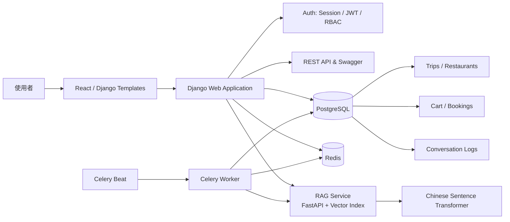
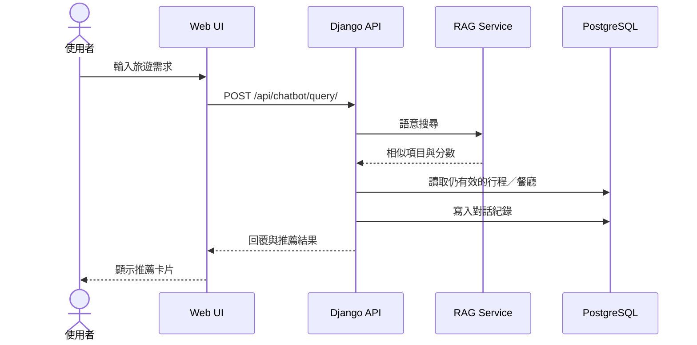

# Django-RAG-Travel-Platform

Django-RAG-Travel-Platform 是一個旅遊電商平台，核心是訂單結帳的高併發交易處理，並整合一套自製語意搜尋引擎作為輔助功能。

## 系統架構圖



**技術堆疊**

| 類別 | 技術選擇 |
|---|---|
| 後端框架 | Django 4.2 + DRF + Gunicorn |
| 資料庫 | PostgreSQL |
| 前端 | React |
| 異步任務 | Celery + Redis |
| 快取 | django-redis |
| 身份驗證 | django-allauth（密碼 + Google OAuth，session-based）+ JWT（DRF API 替代認證） |
| 金流 | PayPal Checkout Server SDK |
| 語意搜尋（輔助） | FastAPI + Sentence Transformer |

**後端核心設計**

1. **高併發防超賣機制**

   結帳時用 `transaction.atomic()` + `select_for_update()` 對 Trip 資料列悲觀鎖定；所有交易強制依 Trip ID 固定升冪順序取鎖，避免不同購物車組合並行結帳時互相等待造成死鎖。訂單建立時設定 `reservation_expires_at`，逾期未付款由背景任務自動釋放庫存。

   ```mermaid
   sequenceDiagram
       actor User as 使用者
       participant Web as Django Web
       participant DB as PostgreSQL

       User->>Web: 提交結帳
       Web->>DB: 開始 transaction
       Web->>DB: SELECT ... FOR UPDATE 鎖定行程
       Web->>DB: 驗證與扣減可用座位
       Web->>DB: 建立 Booking / BookingItem
       Web->>DB: Commit
       Web-->>User: 顯示訂單詳情
   ```

2. **Celery + Redis 異步任務架構**

   訂單確認信、超時未付款回收庫存等耗時任務移到背景執行，避免阻塞主執行緒；`django-redis` 快取熱門行程列表與查詢結果，降低 PostgreSQL 讀取壓力。RAG 索引更新也走這套排程機制：只處理有異動的項目，失敗時保留待處理標記，交由下次排程自動重試。

   對話歷史查詢採 Cache-Aside 模式：先查 Redis，沒命中才查資料庫並寫回快取（TTL 1 小時）；新對話寫入後主動清除該使用者快取，避免讀到過期資料。

   ```mermaid
   sequenceDiagram
       actor User as 使用者
       participant UI as Web UI
       participant Django as Django API
       participant Redis as Redis Cache
       participant DB as PostgreSQL

       User->>UI: 開啟聊天紀錄
       UI->>Django: GET /api/chatbot/history/
       Django->>Redis: GET user:{id}:chat_history

       alt 快取命中
           Redis-->>Django: 已快取的歷史紀錄
       else 快取未命中
           Redis-->>Django: 無資料
           Django->>DB: 查詢 ConversationLog 與推薦項目
           DB-->>Django: 歷史紀錄
           Django->>Redis: SET 歷史紀錄，TTL 1 小時
       end

       Django-->>UI: 回傳歷史紀錄
       UI-->>User: 顯示過往對話
   ```

3. **API 速率限制與安全**

   聊天 API 內建 IP 限流（每分鐘 10 次），超過回 429；身份驗證支援 Session 與 JWT 雙軌並存，未登入直接擋在業務邏輯之前回 401；bcrypt 加鹽雜湊密碼，django-allauth 整合 Google OAuth 2.0，內建 CSRF 防護。

   ```mermaid
   flowchart TD
       A[收到聊天 POST 請求] --> B{已登入？}
       B -- 否 --> U[401 Unauthorized]
       B -- 是 --> C{超過速率限制？}
       C -- 是 --> L[429 Too Many Requests]
       C -- 否 --> D{輸入格式有效？}
       D -- 否 --> V[400 Bad Request]
       D -- 是 --> E[呼叫 RAG Service]
       E --> F{RAG 可用？}
       F -- 否 --> S[503 Service Unavailable]
       F -- 是 --> G[組合推薦結果並寫入對話紀錄]
       G --> H[200 OK]
       E -. 未預期例外 .-> X[500 Internal Server Error]
   ```

4. **服務拆分**

   語意搜尋獨立成 FastAPI 微服務，透過 HTTP 與主系統通訊，讓核心 Django 服務不需背負 torch 等大型 ML 套件依賴。

**輔助功能：語意搜尋（RAG）**

使用者可用自然語言輸入需求（如「適合親子的東南亞行程」），系統將查詢向量化後用餘弦相似度比對行程資料庫，回傳最相關的推薦，不依賴外部 LLM API。模型用 `shibing624/text2vec-base-chinese`（Hugging Face），輕量、CPU 可跑、開源免費。



**目錄結構**
```
Django-RAG-Travel-Platform/
├── accounts/       # 使用者認證（django-allauth，session-based + Google OAuth + JWT）
├── trips/          # 旅遊行程 CRUD 與搜尋
├── cart/           # 購物車（資料庫模型 Cart / CartItem，非 session）
├── bookings/       # 訂單管理，含悲觀鎖交易邏輯（booking_create.py）
├── chatbot/        # RAG 引擎 API 端點
├── rag_service/    # 獨立 FastAPI 微服務（語意搜尋輔助功能）
└── frontend/       # React 前端應用
```

**API 範例**

行程列表（REST API，含分頁，DRF）
```
GET /trips/api/?page=1
```
完整 API 文件（Swagger）：/api/docs/

使用者登入
```
GET /accounts/google/login/
GET /accounts/google/login/callback/
```
登入狀態預設以 Django session（sessionid cookie）維持；同時 DRF API 另外支援 Bearer JWT 作為替代認證方式（`Authorization: Bearer <token>`），依前端需求擇一使用。另提供 `POST /user/api/login/` 供 API 測試工具（如 Postman）以 email/password 直接登入，預設回傳 session cookie。

**技術挑戰與解決方案**

| 挑戰 | 解決方案 |
|---|---|
| 高併發結帳超賣：多使用者同時搶購同一行程最後名額 | `select_for_update()` 悲觀鎖 + 依 Trip ID 排序取鎖防死鎖 |
| 未付款訂單佔用庫存 | `reservation_expires_at` 預約時效，背景任務逾期自動釋放 |
| ML 依賴體積龐大，拖慢主服務部署 | 語意搜尋拆分為獨立 FastAPI 微服務 |
| 部署方式演進 | 專案初期曾以 Docker + Docker Compose 容器化，後續改回原生 venv 部署以簡化本機除錯 |

**快速開始（本地開發）**
```bash
cp .env.example .env
python3 -m venv .venv && source .venv/bin/activate
pip install -r requirements-basic.txt

.venv/bin/python manage.py migrate
.venv/bin/python manage.py createsuperuser
.venv/bin/python manage.py runserver 8080
```
若需啟用語意搜尋功能，另需安裝 `requirements-ml.txt` 並啟動 `rag_service`（見 README）。

授權：MIT License

---

中文版先给你确认排版跟内容对不对，确认没问题我再补英文版（结构一样，五张图放同样的位置）。
---

## English

Django-RAG-Travel-Platform is a travel e-commerce platform whose core is high-concurrency transaction handling for checkout, with a self-built semantic search engine as a supporting feature.

**Tech Stack**

| Category | Technology |
|---|---|
| Backend | Django 4.2 + DRF + Gunicorn |
| Database | PostgreSQL |
| Frontend | React |
| Async tasks | Celery + Redis |
| Caching | django-redis |
| Auth | django-allauth (password + Google OAuth, session-based) |
| Payments | PayPal Checkout Server SDK |
| Semantic search (supporting) | FastAPI + Sentence Transformer |

**Backend Design Highlights**

1. **Concurrency-safe checkout (overselling prevention)**
   Checkout uses `transaction.atomic()` + `select_for_update()` to pessimistically lock `Trip` rows. All transactions acquire locks in a fixed ascending order by Trip ID, preventing deadlocks when different carts checkout concurrently with overlapping trips. Each booking sets `reservation_expires_at`; a background task automatically releases inventory if payment isn't completed in time.

2. **Celery + Redis async task architecture**
   Slow operations (confirmation emails, releasing inventory on expired unpaid orders) run in the background instead of blocking the main thread. `django-redis` caches popular trip listings and query results to reduce read pressure on PostgreSQL. The RAG index update pipeline reuses this same scheduling pattern: only changed items are re-processed, and failed items are flagged for automatic retry on the next scheduled run.

3. **Auth & security**
   bcrypt salted password hashing, django-allauth with Google OAuth 2.0, built-in session CSRF protection.

4. **Service separation**
   Semantic search runs as an independent FastAPI microservice over HTTP, keeping heavy ML dependencies like torch out of the core Django service.

**Supporting feature: semantic search (RAG)**

Users can describe what they want in natural language (e.g. "family-friendly trip to Southeast Asia"). The query is vectorized and matched against the trip database via cosine similarity — no external LLM API call needed. Model: `shibing624/text2vec-base-chinese` (Hugging Face) — lightweight, CPU-only, open-source.

**Architecture**
```
Django-RAG-Travel-Platform/
├── accounts/       # Auth (django-allauth, session-based + Google OAuth)
├── trips/          # Trip CRUD & search
├── cart/           # Cart (Cart / CartItem DB models, not session-based)
├── bookings/       # Order management, incl. pessimistic-lock transaction logic (booking_create.py)
├── chatbot/        # RAG engine API endpoints
├── rag_service/    # Independent FastAPI microservice (semantic search, supporting feature)
└── frontend/       # React frontend
```

**API Examples**

Trip list (REST API, paginated, DRF)
```
GET /trips/api/?page=1
```
Full API docs (Swagger): /api/docs/

Login (Google OAuth flow)
```
GET /accounts/google/login/
GET /accounts/google/login/callback/
```
Login state is maintained via a Django session — no JWT is issued. A `POST /user/api/login/` endpoint is also available for direct email/password login via API testing tools.

**Key Technical Challenges**

| Challenge | Solution |
|---|---|
| Overselling under high-concurrency checkout | `select_for_update()` pessimistic locking + fixed Trip ID lock ordering to prevent deadlocks |
| Unpaid orders holding inventory hostage | `reservation_expires_at` reservation window; background task auto-releases on expiry |
| ML dependency bloat slowing down core service deployment | Split semantic search into an independent FastAPI microservice |
| Deployment evolution | Initially containerized with Docker + Docker Compose; later reverted to native venv to simplify local debugging |

**Quick Start**
```bash
cp .env.example .env
python3 -m venv .venv && source .venv/bin/activate
pip install -r requirements-basic.txt

.venv/bin/python manage.py migrate
.venv/bin/python manage.py createsuperuser
.venv/bin/python manage.py runserver 8080
```
To enable semantic search, additionally install `requirements-ml.txt` and start `rag_service` (see README).

License: MIT License
