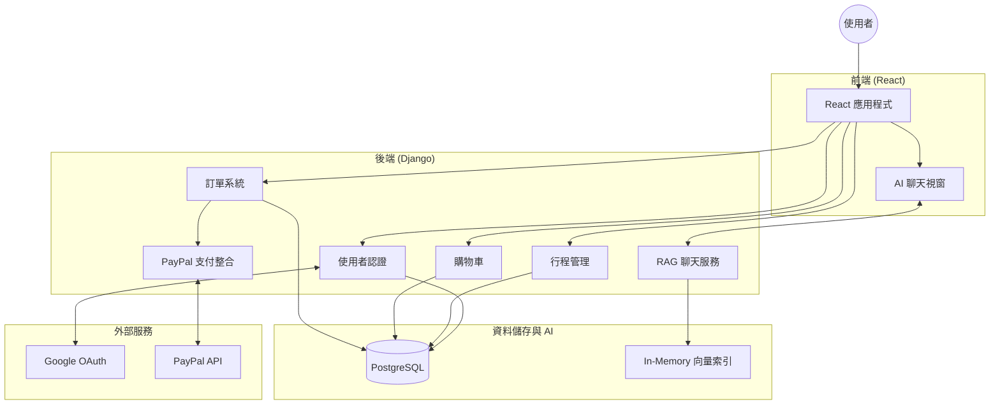

# Django RAG Travel Platform

[繁體中文](#繁體中文) ｜ [English](#english)

---

## 繁體中文

### 專案簡介

Django-RAG-Travel-Platform 是一個結合 **Django REST 後端**與**自製 RAG（Retrieval-Augmented Generation）語義搜尋**的智慧旅遊電商平台。使用者可以透過 AI 聊天機器人輸入自然語言需求，系統即時推薦最符合的旅遊行程並完成線上訂購。


---

### 技術棧


| 類別 | 技術選擇 |
|---|---|
| 後端框架 | Django 4.2 + Gunicorn |
| 資料庫 | PostgreSQL 16 |
| 前端 | React 18 |
| AI / 向量搜尋 | sentence-transformers（`text2vec-base-chinese`） |
| 相似度計算 | Cosine Similarity（scikit-learn） |
| 身份驗證 | django-allauth（帳密 + Google OAuth） |
| 金流 | PayPal Checkout Server SDK |
| 容器化 | Docker + Docker Compose |
| 靜態檔案 | WhiteNoise |

---

### 系統架構



#### 目錄結構

```
Django-RAG-Travel-Platform/
├── accounts/           # 使用者認證（JWT + Google OAuth）
├── trips/              # 旅遊行程 CRUD 與搜尋
├── cart/               # 購物車（Session-based）
├── bookings/           # 訂單管理與狀態追蹤
├── chatbot/            # RAG 引擎（向量化 + 語義搜尋）
│   ├── llm.py          # SimpleRAG 核心邏輯
│   └── services/       # 對話服務層
├── frontend/           # React 前端應用
├── scripts/            # 初始化腳本（RAG 資料載入）
└── docker-compose.yml  # 多容器編排
```

---

### RAG 技術設計

#### 為什麼選 RAG 而非直接用 LLM？

本專案的情境是推薦**平台自身資料庫中的旅遊產品**，LLM 本身的知識無法涵蓋這些私有資料。RAG 的做法是：

1. **事先向量化**：啟動時將所有行程資料 encode 為向量索引（in-memory）
2. **語義搜尋**：收到使用者問題時，將問題向量化，用 Cosine Similarity 找出最相關的行程
3. **回應生成**：將搜尋結果格式化回傳，不依賴外部 LLM API（降低延遲與成本）

#### 向量模型選擇

選用 `shibing624/text2vec-base-chinese`（HuggingFace），原因：
- 專為**繁/簡體中文**語義相似度優化
- 模型輕量（~400MB），適合 CPU 推論，不需 GPU
- 開源免費，無 API 呼叫費用

#### 向量搜尋流程

```
使用者輸入 → encode() → query_vector
行程資料庫 → encode() → trip_embeddings（啟動時建立）
                    ↓
         Cosine Similarity 矩陣計算
                    ↓
         Top-K 最相似行程 → 格式化回應
```

---

### API 範例

#### 聊天 / 行程推薦

```
POST /api/chatbot/chat/
Content-Type: application/json
Authorization: Bearer <token>

Request:
{
  "message": "我想去東南亞，預算3萬，適合親子旅遊的行程"
}

Response:
{
  "reply": "根據您的需求，以下是推薦行程：",
  "recommendations": [
    {
      "id": 12,
      "name": "峇里島親子歡樂5日遊",
      "country": "印尼",
      "city": "峇里島",
      "duration": 5,
      "similarity_score": 0.923
    }
  ]
}
```

#### 使用者登入（Google OAuth 流程）

```
GET /accounts/google/login/       # 導向 Google 同意頁面
GET /accounts/google/login/callback/  # OAuth callback，建立 Session
```

#### 建立訂單

```
POST /api/bookings/create/
Content-Type: application/json
Authorization: Bearer <token>

Request:
{
  "trip_id": 12,
  "travelers": 2,
  "travel_date": "2025-06-15"
}

Response:
{
  "booking_id": "BK-20250312-0042",
  "status": "pending_payment",
  "total_price": 29800,
  "paypal_order_id": "PAY-xxxxxxxxxxxxxxxx"
}
```

---

### 技術挑戰與解決方案

#### 1. 中文語義搜尋準確度

**問題**：使用者輸入的措辭與行程資料的關鍵字差異大（例：「帶小孩」vs「親子」）  
**解法**：選用針對中文語義相似度訓練的 sentence-transformer 模型，而非關鍵字比對，大幅提升召回率

#### 2. RAG 系統啟動時間

**問題**：每次 Django 啟動都需重新 encode 所有行程向量，初始化耗時  
**解法**：向量結果以 in-memory 方式快取，透過 `python manage.py init_rag` 指令手動或容器啟動時觸發一次即可

#### 3. Google OAuth 與 Django Session 整合

**問題**：django-allauth 預設使用 Session，但前後端分離架構需要 Token-based 驗證  
**解法**：在 OAuth callback 後自動產生並回傳 JWT Token，讓 React 前端統一使用 Bearer Token 存取 API

---

### 快速開始（本地開發）

```bash
# 1. 複製環境設定
cp .env.example .env
# 填寫 .env 中的 DB、Google OAuth 等設定

# 2. 啟動容器
docker-compose up -d

# 3. 初始化資料庫與 RAG
docker-compose exec web python manage.py migrate
docker-compose exec web python manage.py init_rag

# 4. 建立管理員帳號
docker-compose exec web python manage.py createsuperuser
```

---

## English

### Overview

Django-RAG-Travel-Platform is an intelligent travel e-commerce platform combining a **Django REST backend** with a **custom-built RAG (Retrieval-Augmented Generation) semantic search engine**. Users interact with an AI chatbot in natural language, and the system recommends the most relevant travel packages for online booking.


---

### Tech Stack

| Category | Technology |
|---|---|
| Backend | Django 4.2 + Gunicorn |
| Database | PostgreSQL 16 |
| Frontend | React 18 |
| AI / Vector Search | sentence-transformers (`text2vec-base-chinese`) |
| Similarity | Cosine Similarity (scikit-learn) |
| Auth | django-allauth (password + Google OAuth) |
| Payments | PayPal Checkout Server SDK |
| Containerization | Docker + Docker Compose |
| Static Files | WhiteNoise |

---

### RAG Design

#### Why RAG instead of a direct LLM call?

The goal is to recommend products from **our own private database**. An LLM has no knowledge of this data. RAG solves this by:

1. **Pre-encoding**: At startup, all trip records are encoded into an in-memory vector index
2. **Semantic search**: The user's query is vectorized and matched against the index via Cosine Similarity
3. **Response generation**: Top-K matches are formatted and returned — no external LLM API needed, reducing latency and cost

#### Model Selection

`shibing624/text2vec-base-chinese` was chosen because:
- Optimized for Traditional/Simplified **Chinese semantic similarity**
- Lightweight (~400MB), runs on **CPU** without GPU
- Open source, zero API cost

#### Search Pipeline

```
User input → encode() → query_vector
Trip records → encode() → trip_embeddings (built at startup)
                    ↓
         Cosine Similarity matrix
                    ↓
         Top-K results → formatted response
```

---

### API Examples

#### Chat / Trip Recommendation

```
POST /api/chatbot/chat/
Authorization: Bearer <token>

{ "message": "Family trip to Southeast Asia, budget around 30,000 TWD" }

→ Returns top-K trips with similarity scores
```

#### Booking Creation

```
POST /api/bookings/create/
Authorization: Bearer <token>

{ "trip_id": 12, "travelers": 2, "travel_date": "2025-06-15" }

→ Returns booking ID, status, and PayPal order ID
```

---

### Key Technical Challenges

| Challenge | Solution |
|---|---|
| Chinese semantic mismatch (「帶小孩」vs「親子」) | Used a Chinese-specific sentence-transformer instead of keyword matching |
| RAG initialization time on startup | Vectors are cached in-memory; init triggered once via management command |
| Google OAuth + JWT in SPA architecture | Custom callback handler issues JWT after OAuth flow completes |

---

### Quick Start

```bash
cp .env.example .env        # Configure environment
docker-compose up -d        # Start containers
python manage.py migrate    # Setup database
python manage.py init_rag   # Build RAG vector index
```

---

## License

MIT License. See [LICENSE](LICENSE) for details.
